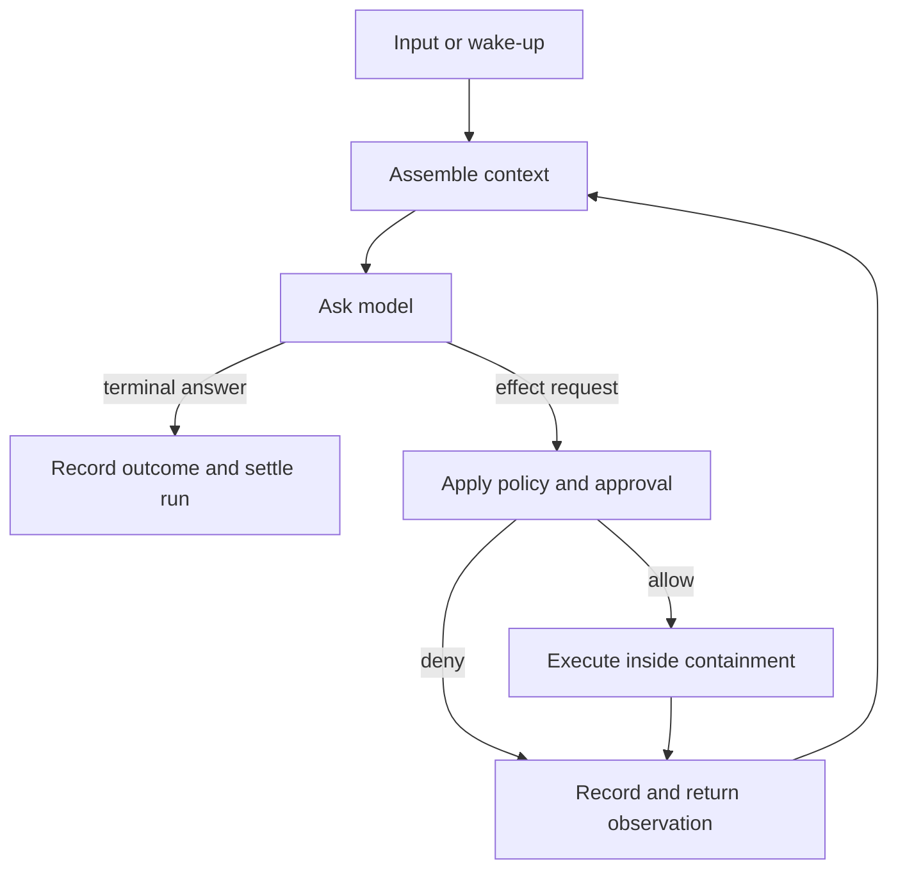

# Common anatomy

Start with the [worked walkthrough](walkthrough.md) if the terms on this page are new.

The ten systems differ in scale, but their inner work can be described with one recurring machine:



The loop itself is small. Most engineering difficulty lives around it: deciding what the model sees, making effects safe, preserving identities across retries, streaming partial facts, recovering after interruption, and allowing several clients or agents to observe the same work.

The [glossary](glossary.md) gives the atlas’s preferred terms and upstream synonyms.

## The nine layers

1. **Capability boundary.** Files, commands, search, Model Context Protocol (MCP) servers, browsers, human questions, subagents, and clocks become named operations with request and response schemas.
2. **Provider boundary.** A canonical model request is translated into one provider dialect; provider stream fragments are translated back into canonical events.
3. **Context builder.** Instructions, history, capability descriptions, workspace facts, memory, attachments, and compaction summaries are selected under a token budget.
4. **Turn engine.** The engine calls the model, recognizes effect requests, waits for results, and decides whether to continue, pause, retry, or settle.
5. **Policy boundary.** Static rules, human approval, operating-system sandboxing, path guards, and runtime containment constrain capability execution. These mechanisms are related but not interchangeable.
6. **Durable state.** Sessions, messages, operation lifecycles, summaries, checkpoints, and child links survive process loss. Mature systems separate committed facts from user-interface projections.
7. **Event surface.** A terminal user interface (TUI), graphical user interface (GUI), JSON Lines (JSONL), remote procedure call (RPC), Agent Client Protocol (ACP), or remote channel consumes a shared event vocabulary instead of owning the loop.
8. **Orchestration.** Subagents, queues, worktrees, schedulers, and fleet managers create and supervise other runs.
9. **Evaluation and operations.** Usage, latency, retries, watchdogs, replay, deterministic tests, and traces reveal whether the machine remains coherent over time.

A project need not expose all nine as separate modules. The list is a comparison frame: when two concerns share one implementation object, ask whether they still have different semantics and lifetimes.

## One interaction, several different lifetimes

Suppose you tell a coding agent:

> Rename `foo` to `bar` and update the tests.

That looks like one action from the outside. Inside the harness, several different things begin and end at different times. Keeping them separate makes retry, cancellation, persistence, and debugging much easier to reason about.

### Work lifetimes

Think of these as nested scopes of work:

```text
session
└── run
    └── turn
        └── provider request
            └── physical attempt
```

- The **session** is the long-lived conversation or task history. You may issue many instructions in the same session.
- The **run** is the work caused by this instruction: “rename `foo` to `bar` and update the tests.” When that work finishes, the session can remain open for your next instruction.
- A **turn** is one model response together with the effects it asks for. The model might first inspect files, then receive those results and take another turn to edit them.
- A **provider request** is one exact payload sent to the model provider. It includes the context chosen for that call.
- A **physical attempt** is one transmission of that exact request. If the network times out and the harness sends the same payload again, that is still one request but two attempts.

This distinction matters because “try again” can mean two different things. Sending the identical payload again is another **attempt**. Rebuilding the context and asking the model again creates a new **request**, even if the user instruction has not changed.

| Work lifetime | In the example | What goes wrong if it is confused with its neighbors |
| --- | --- | --- |
| Session | the continuing conversation with the coding agent | cancelling one piece of work accidentally destroys the whole history |
| Run | all work caused by the rename instruction | the next instruction inherits stale cancellation state or counters |
| Turn | one model response plus the effects it requests | tool loops and retries get counted as new user instructions |
| Provider request | one exact model payload | changed context is mislabeled as a retry of the same request |
| Physical attempt | one transmission of that payload | latency, usage, and provider failures are counted incorrectly |

### World and state lifetimes

A second group describes what the agent tries to do and how the system remembers it:

```text
tool operation → fact/event → projection
```

Suppose the model asks to run the test suite.

- The **tool operation** is that proposed test command, with its own stable identity. A retry of the surrounding model request should not accidentally execute it twice.
- A **fact/event** records something that actually happened: for example, the command started, finished with exit code 1, or was denied.
- A **projection** is a view built from those facts: the terminal line, progress spinner, GUI card, remote notification, or reconstructed transcript shown to the user.

The key idea is that the screen is not the event. If a renderer crashes after the command completed, the durable fact should still say what happened. The interface can then rebuild the view.

| State lifetime | In the example | What goes wrong if it is confused with its neighbors |
| --- | --- | --- |
| Tool operation | “run the tests” with one stable call identity | replay or transport retry executes the command twice |
| Fact/event | “tests finished with exit code 1” | mutable interface state becomes the only audit trail |
| Projection | the terminal or GUI rendering of that result | a rendering failure corrupts what the system believes happened |

Vocabulary varies across projects. The names matter less than the separations. DeepChat states the request/attempt distinction most explicitly; Codex’s thread/rollout split, Pi’s event sequence, Kimi Code’s event bus, and Kun’s runtime-event reducer expose adjacent parts of the same design.

## Four architecture families, not one leaderboard

- **Library core:** Pi makes the loop, messages, capabilities, and events separable from the coding product.
- **Complete local harness:** Codex, OpenCode, Grok Build, Kimi Code, and MiMo Code own the loop and one or more user or protocol surfaces.
- **Desktop interaction system:** Kun, DeepChat, and CodePilot add persistent GUI state, remote channels, computer use, and human interaction around a loop.
- **Meta-harness:** Multica normally drives another agent process. Its model-facing boundary is an agent-command-line adapter, not a model API.

A feature in Multica is evidence about supervising agents; it is not automatically evidence about the proper shape of an inner turn engine. A renderer convenience in a desktop client should likewise not become part of a model-facing semantic core merely because it is visible.

## Recurring failure modes

- **Callback soup.** Permissions, tool progress, and questions bypass the event protocol. After a restart, the durable history cannot explain why execution paused or resumed.
- **Mutable transcript as truth.** Partial rendering or process loss leaves no authoritative account. The screen said “done,” but no durable completion fact exists.
- **Retry without identity.** A changed payload is called the same request, or the same effect runs twice after a transport failure.
- **Policy collapsed into tools.** Each handler reinvents approval and path checks, while an external capability bypasses them.
- **Compaction as destructive rewrite.** A summary remains, but the original evidence and its provenance disappear.
- **UI owns execution.** Headless, remote, and embedded clients each develop a different loop and different behavior.
- **One giant “agent state.”** Session, run, request, provider attempt, operation, and projection lifetimes bleed into one another.
- **Feature inheritance mistaken for convergence.** MiMo Code derives from OpenCode; shared code is one lineage, not two independent architectural votes.

## What the common anatomy does not prove

This page is an **inference** over the corpus, not a standard every harness must implement. A distinction earns its place in a design only when it predicts a failure, enables a useful comparison, or supports a required guarantee. Use the [research method](research-method.md) to turn a plausible boundary into a testable question.
