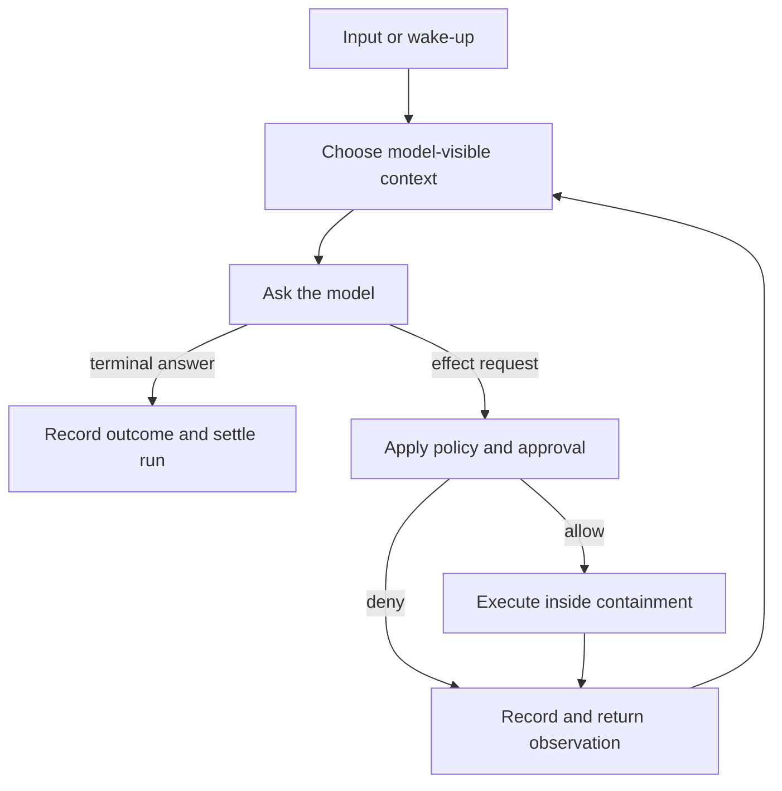

# Common anatomy

Start with the [worked walkthrough](walkthrough.md) if these terms are new.

The inner harness can be understood as one repeated cycle:



The loop is small. Most engineering difficulty comes from making four jobs coherent around it:

1. decide what the model sees;
2. turn proposals into controlled effects;
3. remember what happened;
4. manage work through time, failure, and multiplicity.

This page teaches those four jobs first, then gives the finer nine-layer reference used elsewhere in the atlas.

## Job 1: decide what the model sees

A session may contain a long history, files, instructions, memories, tool definitions, and earlier summaries. A model call can see only one finite request.

The **context builder** chooses and renders that request. It may:

- combine system, project, and user instructions;
- select prior messages or durable facts;
- include file or workspace evidence;
- describe the capabilities available for this call;
- insert memory or attachments;
- compact older material under a token budget.

The **provider boundary** then translates the rendered request into one provider’s wire format and translates streamed output back into the harness’s event vocabulary.

These are separate concerns. Context construction decides *what is asked*. Provider adaptation decides *how the request is transmitted*. A provider retry should not silently rebuild context and pretend the request stayed identical.

Questions to ask:

- Can the exact model-visible request be reconstructed?
- Which instructions and capabilities were active for this call?
- Does compaction preserve the evidence behind its summary?
- Which provider-specific facts are lost in the common protocol?

## Job 2: turn proposals into controlled effects

A model can propose a read, edit, command, browser action, human question, or child agent. The harness must turn that proposal into a named operation with a lifecycle.

A mature effect path usually has distinct stages:

```text
capability declaration
→ structured request
→ policy and approval
→ execution inside containment
→ recorded result
→ model-visible observation
```

The stages answer different questions.

- A **capability boundary** defines what kinds of operations exist and their request/response shapes.
- **Policy** decides whether an operation should proceed.
- **Approval** records a human or delegated decision when policy asks.
- **Containment** limits what the executing process can actually reach.
- The **executor** performs the effect and returns an outcome.

Approval and sandboxing are not substitutes. “The user allowed this command” does not mean the command should receive unrestricted filesystem or network access. “The process is sandboxed” does not mean every action inside the sandbox was authorized.

Questions to ask:

- Does one operation keep the same identity through approval, execution, retry, and result?
- Can external or plugin capabilities bypass checks that built-in tools pass through?
- Is denial represented as an observation the model can understand?
- What happens when the effect’s outcome is unknown after a crash?

## Job 3: remember what happened

A live interface is not durable truth.

The harness may emit streaming events for responsiveness, but it also needs an authoritative record for recovery, audit, and later context construction. The record may be a session log, rollout, journal, Tape, database, or append-oriented file.

Three concepts should remain distinct:

```text
operation → fact/event → projection
```

- A **tool operation** is one proposed effect and its lifecycle.
- A **fact/event** records an occurrence: requested, approved, started, completed, failed, denied, or cancelled.
- A **projection** is a view built from facts: a transcript, progress card, index row, notification, or reconstructed client state.

The key rule is **fact before projection**. Record the authoritative occurrence before a renderer or remote client claims it happened. Then a client can crash and reconnect without changing the execution history.

Not every durable store offers the same guarantee. A transcript may prove what was shown to a user. It may not prove the exact model request, the state of an external effect, or whether partial output had crossed a safe retry boundary.

Questions to ask:

- What survives process death?
- Can the system distinguish durable facts from live coordination?
- Can views be rebuilt without replaying real effects?
- What evidence supports compaction, retry, resume, and audit claims?

## Job 4: manage work through time and multiplicity

One user request can involve several model calls, effects, retries, pauses, and children. Several clients may observe it. Several runs may share one session. Work may continue after a window closes.

The harness therefore needs explicit lifetimes, cancellation scopes, and ownership.

```text
session
└── run
    └── logical turn
        └── provider request
            └── physical attempt
```

- The **session** is the long-lived conversation or task history.
- The **run** is the work admitted because of one input or wake-up.
- A **logical turn** is one accepted model response and the effects requested from it.
- A **provider request** is one fixed model payload.
- A **physical attempt** is one transmission of that payload.

Orchestration adds children, queues, worktrees, schedules, and fleet workers. Operations add tracing, usage, watchdogs, replay, and deterministic tests.

Questions to ask:

- Who owns each child and how does its result return?
- What exactly does cancellation stop?
- Can a run survive client disconnection?
- Which counters and failure state reset between runs?
- What is visible to an outer supervisor and what remains inside a foreign harness?

## The nine-layer reference map

The four jobs are the teaching model. The atlas uses nine layers when a more precise comparison is needed.

| Layer | Belongs mainly to | The question it answers |
| --- | --- | --- |
| **1. Capability boundary** | controlled effects | What operations can the model request, and in what schema? |
| **2. Provider boundary** | model-visible context | How are canonical requests and provider streams translated? |
| **3. Context builder** | model-visible context | Which evidence, instructions, tools, and summaries enter this call? |
| **4. Turn engine** | time and lifecycle | When does the loop continue, pause, retry, compact, or settle? |
| **5. Policy boundary** | controlled effects | Should an operation run, who decides, and how is execution contained? |
| **6. Durable state** | recorded truth | Which sessions, facts, outcomes, summaries, and links survive failure? |
| **7. Event surface** | recorded truth and clients | How do TUI, GUI, RPC, ACP, JSONL, or remote clients observe the same work? |
| **8. Orchestration** | time and multiplicity | How are children, queues, worktrees, schedules, or fleets supervised? |
| **9. Evaluation and operations** | time and evidence | How are retries, usage, latency, traces, replay, and failure detected? |

A project need not expose nine modules. The list is a comparison frame. When two concerns share one object, ask whether they still have different authority, ordering, and lifetimes.

## One interaction, several lifetimes

Suppose you tell a coding agent:

> Rename `foo` to `bar` and update the tests.

From the outside this looks like one action. Inside, several scopes begin and end at different times.

### Work lifetimes

| Work lifetime | In the example | What goes wrong if it is confused with its neighbors |
| --- | --- | --- |
| Session | the continuing conversation with the coding agent | cancelling one piece of work accidentally destroys the whole history |
| Run | all work caused by the rename instruction | the next instruction inherits stale cancellation state or counters |
| Logical turn | one model response plus the effects it requests | tool loops and retries get counted as new user instructions |
| Provider request | one exact model payload | changed context is mislabeled as a retry of the same request |
| Physical attempt | one transmission of that payload | latency, usage, and provider failures are counted incorrectly |

“Try again” can mean two different things. Sending identical bytes again creates another **attempt**. Rebuilding context creates a new **request**, even when the user instruction is unchanged.

### World and state lifetimes

Suppose the model asks to run the test suite.

- The **tool operation** is that proposed command, with one stable identity.
- A **fact/event** may record that it started and finished with exit code 1.
- A **projection** may show a red command card or terminal line.

| State lifetime | In the example | What goes wrong if it is confused with its neighbors |
| --- | --- | --- |
| Tool operation | “run the tests” with one stable call identity | replay or transport retry executes the command twice |
| Fact/event | “tests finished with exit code 1” | mutable interface state becomes the only audit trail |
| Projection | the terminal or GUI rendering of that result | a rendering failure corrupts what the system believes happened |

Vocabulary varies. The names matter less than the separations. DeepChat states request/attempt identity most explicitly; Codex’s thread and rollout, Pi’s event sequence, Kimi Code’s event bus, DeepSeek’s event planes, and Kun’s event reducer expose neighboring parts of the same design space.

## The projects operate at different scales

The thirteen projects are not all trying to be the same thing. Before comparing features, ask what level of the system the project owns.

- **Pi** is closest to a reusable agent engine. Its core loop can be embedded inside another product.
- **Codex, OpenCode, Grok Build, Kimi Code, DeepSeek Harness, MiMo Code, and Prime Agent** are complete local harnesses. They combine the loop with tools, persistence, policy, and one or more interfaces.
- **Kun, DeepChat, and CodePilot** extend further into desktop and product concerns such as durable GUI state, remote interaction, and several ways to control one agent.
- **bb** is an agent development environment and control plane around provider harnesses. Its threads, hosts, workspaces, and plugins are product authority; the provider still owns the inner model loop.
- **Multica** sits outside independent agent programs. It starts and supervises them rather than calling the underlying model API itself.

Scale changes what a project can prove.

A strong Multica watchdog is evidence about supervising a process. It is not evidence about representing one model turn. A convenient desktop “collapse output” state is evidence about presentation. It need not belong in the core execution model.

The practical rule is: **compare projects only at the level where their responsibilities overlap.**

## Recurring failure modes

### Boundaries disappear

- **Callback soup:** permissions, questions, and tool progress bypass the event protocol.
- **Policy collapsed into tools:** each handler reinvents checks while external capabilities bypass them.
- **UI owns execution:** headless, remote, and desktop clients develop different loops.

### Time and identity blur

- **Retry without identity:** a changed payload is called the same request, or an effect runs twice.
- **One giant agent state:** session, run, request, attempt, operation, and projection lifetimes bleed together.
- **Cancellation without scope:** “stop” sometimes kills a command and sometimes destroys a session.

### Evidence is weaker than the claim

- **Mutable transcript as truth:** the screen says “done,” but no authoritative completion fact exists.
- **Compaction as destructive rewrite:** a summary survives while its evidence and provenance disappear.
- **Projection mistaken for recovery:** a product can redraw a transcript but cannot determine what the model saw or whether an effect committed.
- **Feature inheritance mistaken for convergence:** MiMo Code derives from OpenCode and Prime Agent from Pi; inherited mechanisms are one lineage, not independent votes.

## What the common anatomy does not prove

This page is an **inference** over the corpus, not a standard every harness must implement. A distinction earns its place only when it predicts a failure, enables a useful comparison, or supports a required guarantee.

Use [A map of the harness design space](design-map.md) to see how the specimens answer these questions differently. Use the [research method](research-method.md) before turning a plausible boundary into a recommendation.
